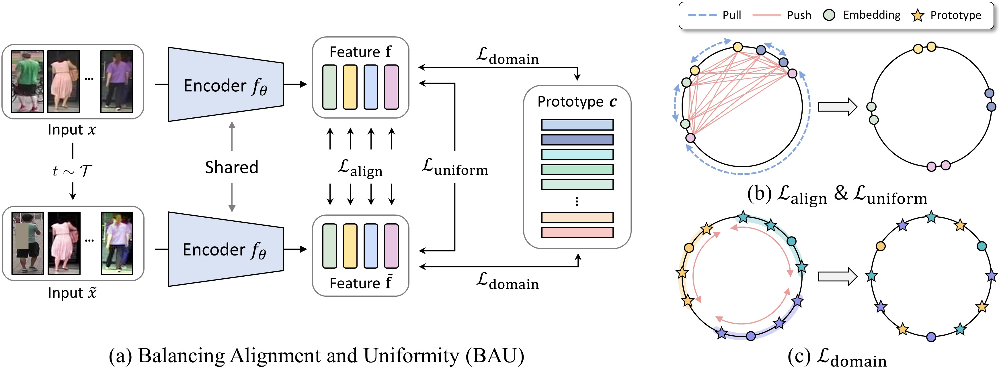

## Balancing Alignment and Uniformity (BAU) 

Official PyTorch implementation of Generalizable Person Re-identification via Balancing Alignment and Uniformity (NeurIPS 2024).

***Code will be made available before NeurIPS. Stay tuned!***

## Updates
- [12/2024] Codes are released.
- [09/2024] BAU has been accepted to NeurIPS 2024.

## Overview

> We propose a Balancing Alignment and Uniformity (BAU) framework, which effectively mitigates the polarized effect of data augmentation by maintaining a balance between alignment and uniformity. Specifically, BAU incorporates alignment and uniformity losses applied to both original and augmented images and integrates a weighting strategy to assess the reliability of augmented samples, further improving the alignment loss. Additionally, we introduce a domain-specific uniformity loss that promotes uniformity within each source domain, thereby enhancing the learning of domain-invariant features. Our BAU effectively exploits the advantages of data augmentation, which previous studies could not fully utilize, and achieves state-of-the-art performance without requiring complex training procedures.
